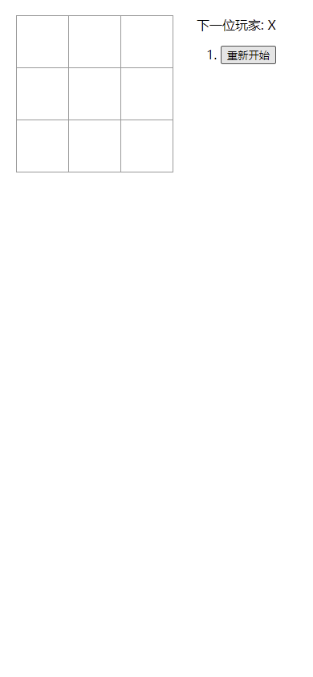
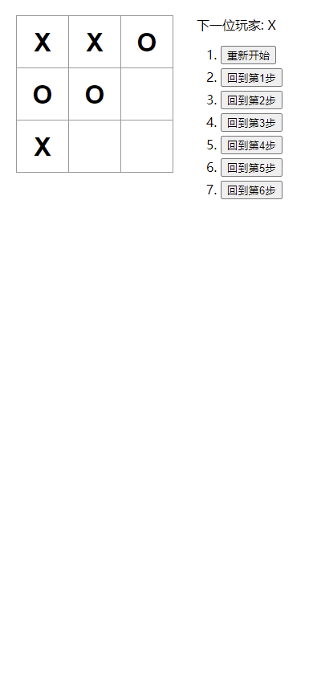
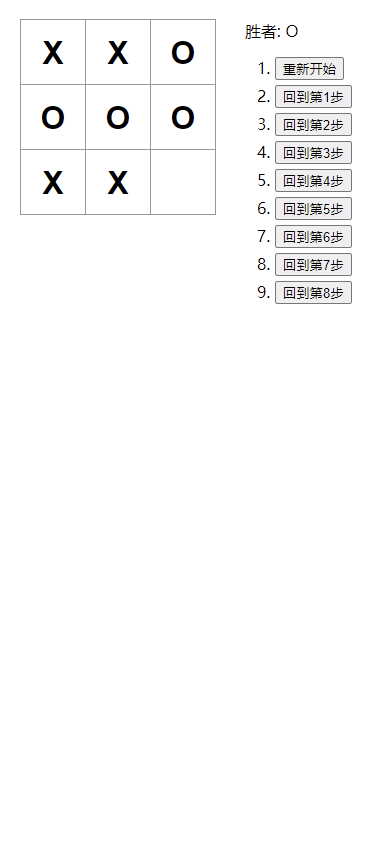
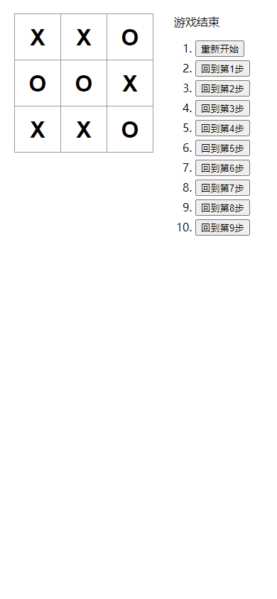

# Tic Tac Toe Hook

## 项目介绍

本项目为 React 官网教程中的[Tic Tac Toe 小游戏](https://zh-hans.reactjs.org/tutorial/tutorial.html)的 React Hook 实现。  
本项目为本人学习 React 和 React Hook 时的练手项目，保留了教程中大部分代码，仅改写为 React Hook 并进行了汉化和 UI 上的美化。  
本项目框架基于 `react 18`。

## 技术栈

`react`

## 截图

